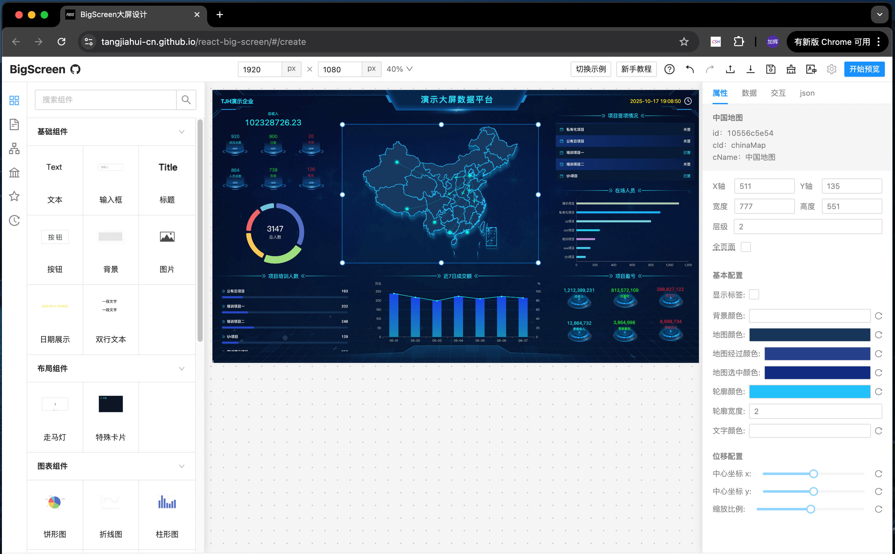
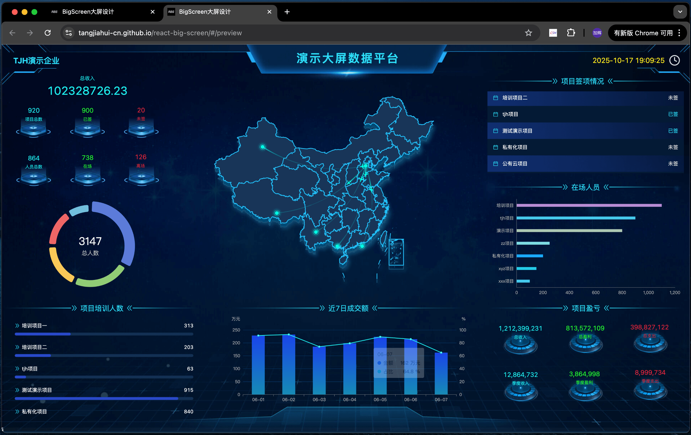

# React-Big-Screen

react-big-screen 是一个使用React开发的`前端可拖拽大屏`开源项目，通过简单的拖拽和配置即可搭建页面。本项目已经实现了大部分的核心功能，包括：拖拽系统、多页面管理、组件联动、远程组件、预览页等（详见下文）。

## 页面截图

编辑：



预览：



## 核心功能

- ✅ 拖拽系统。
- ✅ 成组、取消成组
- ✅ 鼠标范围框选
- ✅ 右键菜单
- ✅ 快捷键
- ✅ 多组件联动
- ✅ 多页面管理
- ✅ 自定义组件
- ✅ 自定义属性面板
- ✅ 自适应预览页
- ✅ 容器组件
- ✅ 加载远程组件
- ✅ i18n国际化
- ✅ 可撤销历史记录
- ✅ 导入、导出文件

## 快速开始

注：仅支持node版本20+、react版本18+

```shell
pnpm install react-big-screen
```

```tsx
// index.tsx
import { EXAMPLE, RbsEngine } from "react-big-screen";
import * as React from "react";
import "antd/dist/antd.min.css";
import "react-big-screen/es/style.css";

export default () => {
  const domRef = React.useRef<HTMLDivElement>(null);

  React.useEffect(() => {
    const engine = new RbsEngine();
    
    // 挂载到DOM
    engine.mount(domRef.current!).then(() => {
      // 挂载成功后，导入JSON文件
      engine.importJSON(EXAMPLE.classic);
    });
    
    // 销毁
    return () => {
      engine.destroy()
    };
  }, []);

  return (
    <div
      ref={domRef}
      style={{
        width: "100vw",
        height: "100vh",
        position: "fixed",
        overflow: "hidden",
      }}
    />
  );
};
```

## 本地调试
本地启动一个项目，用以调试或者开发功能。
```shell

# 进入目录
cd react-big-screen

# 安装依赖
# node@20.15.1、pnpm@9.13.2 （或：node@16.20.1、pnpm@7.30.x）
pnpm i

# 本地运行
pnpm dev
```

## 创建一个自定义组件

开发自定义组件，只需要3步：
- 创建渲染组件 `Component`。
- 创建属性配置组件 `Attributes`。
- 注册自定义组件对象。

### 1. 创建 `Component`
使用内置的`createComponent`创建自定义组件，可以享受编辑器类型提示。
```tsx
import engine, { createComponent } from '@/engine';

// 配置属性值类型
interface Options {
  value: string; // 显示内容
}

const Component = createComponent<Options>(props => {
  const { options, width, height } = props;
  return (
    <div style={{ width, height }}>
      {options?.value}
    </div>
  )
})
```

### 2. 创建`Attributes`
创建属性配置组件，可以使用`createAttributes`或`createAttributesByConfig`。（推荐使用`createAttributesByConfig`，享受更高效的表单配置式开发）

```tsx
// 使用 createAttributes
import engine, { createAttributes } from '@/engine';

// 属性配置组件
const Attributes = createAttributes<Options>(props => {
  const { options, onChange } = props;
  return (
    <div>
      <span>显示内容：</span>
      <input
        value={options?.value}
        onChange={e => onChange({ value: e.target.value })}
        maxLength={100}
      />
    </div>
  )
})

```
```tsx
// 使用 createAttributesByConfig
import engine, { createAttributesByConfig } from '@/engine';

export default createAttributesByConfig<Options>(
  [
    {
      key: "value",
      label: "显示内容",
      component: "input",
      options: {
        maxLength: 100
      },
    },
  ]
);

```

### 3. 注册组件
```tsx
// 注册组件
engine.component.register({
  cId: 'demo-text', // 组件id（必填、唯一）
  cName: 'demo-文字', // 组件名称
  x: 0, // 初始 x
  y: 0, // 初始 y
  width: 200, // 初始宽度
  height: 32, // 初始高度
  component: Component, // 模板组件
  attributesComponent: Attributes, // 属性配置组件
})
```

## 创建一个容器组件
容器组件：一个移动时会同时改变所有关联组件位置的组件。

### 1. 注册容器组件
创建一个容器组件，`创建Component`、`创建Attributes`和普通组件一样，仅需要修改注册对象。

只要注册对象`panels`属性有值，就被认为是一个容器组件。运行时若有组件挂载到该容器，则会设置挂载组件的 `panelId` 为 该容器组件的`currentPanelId`。（注意：panelId为引擎自动绑定请不要修改！）

- panels：当前容器组件所包含的全部面板（panel是容器的一个面板）。
- currentPanelId：当前容器组件展示的面板 panel 的 id。
- panelId: 所属父容器 panels 中某个面板的id。

挂载 / 卸载面板 api：
- engine.componentNode.hidePanel：隐藏一个面板全部子组件
- engine.componentNode.showPanel：显示一个面板全部子组件

```tsx
// 单面板容器组件
engine.component.register({
  // ...
  // 只要包含 panels 属性就被认为是一个容器组件
  // （value值由引擎自动生成，此处置空）
  panels: [{ label: "特殊卡片", value: "" }],
})
```
```tsx
// 多面板容器组件
engine.component.register({
  // ...
  // 只要包含 panels 属性就被认为是一个容器组件
  // （value值由引擎自动生成，此处置空）
  panels: [
    { label: "面板一", value: "" },
    { label: "面板二", value: "" },
    { label: "面板三", value: "" },
  ],
})
```
### 2. 运行时切换面板

```tsx
/**
 * 点击按钮切换面板
 */
import engine, { createComponent } from '@/engine';
import { useEffect, useRef } from "react";

const Component = createComponent<Options>(props => {
  const { options, width, height, componentNode } = props;
  const lastPanelId = useRef()

  // 切换面板
  function handleChange(panelId) {
    if (!panelId || lastPanelId.current === panelId) return;
    // 先隐藏上一个panel的所有组件
    engine.componentNode.hidePanel(lastPanelId.current);
    // 再显示当前panel的组件
    engine.componentNode.showPanel(lastPanelId.current = panelId);
  }

  // 其他组件控制切换
  useEffect(() => {
    handleChange(componentNode?.currentPanelId)
  }, [componentNode?.currentPanelId])

  return (
    <div style={{ width, height }}>
      {componentNode?.panels?.map?.(panel => {
        return (
          <button
            key={panel?.value}
            onClick={() => handleChange(panel?.value)}
          >
            {panel?.label}
          </button>
        )
      })}
    </div>
  )
})
```
## 性能优化
### (1) 组件独立更新
每个组件更新时，只会更新当前渲染节点，而不会更新所有组件。

### (2) 拖拽优化
单个或多个组件拖拽过程中，实时修改对应dom的位置，拖拽结束才会保存生效变更范围内的组件。

### (3) 隐藏组件不渲染
有些不显示的组件，例如处于容器中、或者show设置false等，不会在页面上渲染。等到外界控制其显示时，局部更新其节点重新渲染，而不会影响所有组件。

### (4) 远程组件包优化
组件包下载后，源码存储在浏览器端`IndexedDB`中，不会占用内存。下载时，才会从浏览器存储中取出。

### (5) vite 构建优化
手动分包，将`monaco-editor`等固定不变的大型包单独划分chunk便于更好的利用缓存。<br>
一些随着按需加载体积不断增大的包单独划分（例如：`antd`、`ahooks`等），避免每次改动都更新其他未修改包。<br>

### (6) 按需加载
同时`nginx`设置`gzip`，体积可再次减小`75%`。<br>

常见库替换：
- `dayjs`：代替moment。
- `lodash-es`：代替lodash。

大型库按需加载：
- `echarts`：减小 46%。1050kb => 570kb。
- `monoco-editor`：减小 36%。3600kb => 2308kb。

### (7) 使用“事件委托”实现拖拽
在编辑器容器处监听`mouse`事件，通过`dom.dataset.id`获取实例的一切信息，并借此实现组件移动、放置layout、范围框选中等。无需创建实例数量的事件监听器，节省内存提高性能。

### (8) 合并事件
一个事件同时运行多个功能。例如 `startMove` 支持 `hookQueue`，一次点击流程（`mousedown` -> `mouseup`），即可依次运行每个功能注册的回调函数，无需拖拽实例、选中实例功能各自创建一个`mousedown`的事件监听。

### (9) 异步组件
`component` 和 `attributesComponent` 支持传入`React.lazy(() => import("./...")` 形式，以支持异步组件，减小首屏加载包体积。

### ...

## dom 事件
点击事件只涉及到: `click`、`mousedown`、`mousemove`、`mouseup`。

## 多组件联动

自己单独实现了一套事件机制。`component`中声明了暴露事件列表`exposes`、触发事件列表`triggers`。

- `exposes` 是暴露给外界，用来调用内部事件的端口。
- `triggers` 是声明内部可以触发的事件，用来在 \[属性面板-交互\] 中读取该列表进行配置与其他组件联动。

关于组件内部使用？

在 `props` 中获取 `useExpose`、`handleTrigger`。通过 `useExpose` 去定义运行时暴露的事件行为，`handleTrigger` 去触发内部事件的执行。


## 多页面管理

多页面，主要适用于一个大屏多个子页面的场景。

> 展示一个页面时，其他页面会卸载，不渲染而只保留数据，因此不会造成性能损失。

若要控制多页面切换，需要开发`导航组件`：
- `usePages`：实时获取所有页面
- `useCurrentPageId`: 获取当前页id
- `selectPage`: 选中对应页面（即切换页面）

常见场景：
- 单大屏多子页面：顶部的导航栏tabs，点击打开目标子页面。
- 类SPA站点：头部面包屑导航，点击跳转对应页面。
- 单页面文档站点：导航下拉框，快速打开对应文档页。

> **为什么会出现子页面，容器组件难道不行吗？** <br><br>
> 答：子页面会完整的加载、卸载、刷新一个页面的全部组件，而容器包含的所有组件一直存在（只会随页面卸载而删除）。

## 设计复杂页面

若要实现复杂页面，则需将页面元素抽象成 一个个的实例，多个实例通过`暴露事件`、`触发事件`相互沟通。

在 `react-big-screen` 中，事件机制是一个十分重要的功能，甚至可以触发自身的 `暴露事件`!

> 例如：设计一个中后台查询表格页。我们只需要准备`按钮`、`表格`，点击 `按钮` 触发表格暴露的 `查询` 事件即可。如果想要修改查询参数，则只需要设置解析函数。

另外，有时候会用到多页面管理，在一个页面中支持切换多个子页面。 可以单独开发 `导航组件`，用于管理页面的切换、或当做路由面包屑等。

